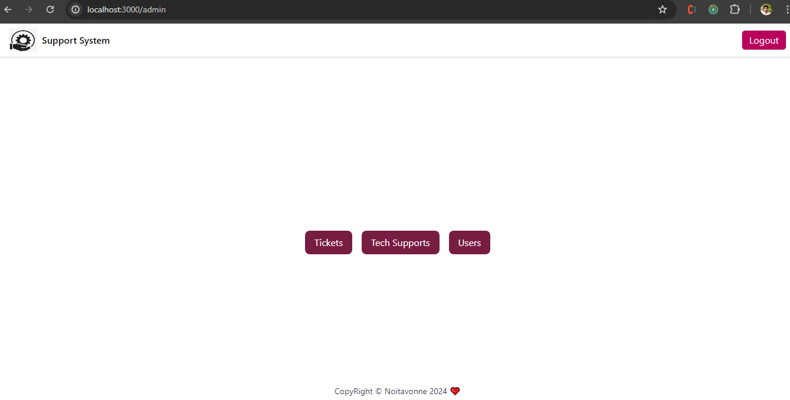
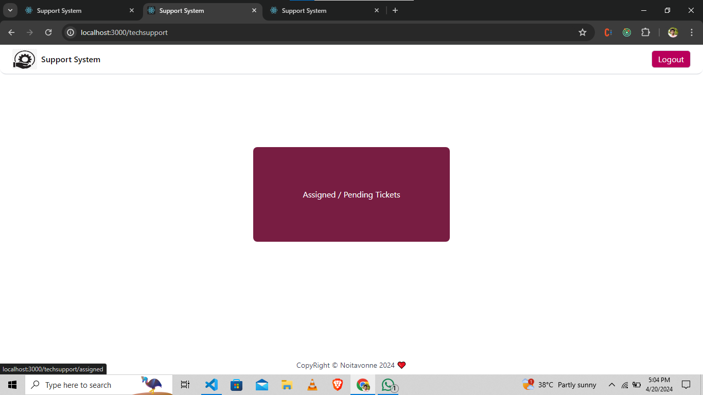

# Getting Started with Create React App

This project was bootstrapped with [Create React App](https://github.com/facebook/create-react-app).

## Available Scripts

In the project directory, you have to run following commands:

# command - npm i
# command - npm start

now open new terminal to start the json-server and run next command 
# command - npm run start-json

Open [http://localhost:3000] to view the website it in your browser.

The page will reload when you make changes.
You may also see any lint errors in the console.

# `UserLogin`

User can signup page and login to website.
[User Home Page]

# `Admin Login`

I will create one admin and provide all the credentials of the admins here.

## "email": "admin@gmail.com",
## "password": "admin"

If you go to the login page and log in with the admin credentials, you will access the admin page
[Admin Home Page]

# `Tech-Support Login`
## "email": "ganesh@gmail.com",
## "password": "0707"

[tech-support Home Page]

